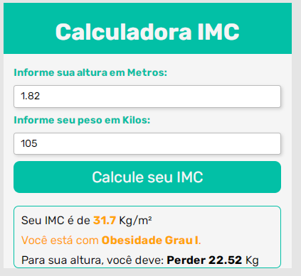

# Calculadora IMC

> This is a IMC calculator created along the lines of a Code Club exercise. In it, the user enters their height and weight and the calculator displays their BMI and how much weight they must lose or gain to have a healthy IMC.

### Adjustments and improvements

The project is still under development and future updates will focus on the following tasks:

- [x] HTML creation
- [x] CSS creation
- [x] JavaScript creation
- [ ] Layout update with ReactJs

## 🤝 Contributors

We thank the following people who contributed to this project:

<table>
  <tr>
    <td align="center">
      <a href="https://www.linkedin.com/in/alleson-de-moura-barbosa-193802210/">
         
        
          <b>Alleson Barbosa</b>
        
      </a>
    </td>
  </tr>
</table>
